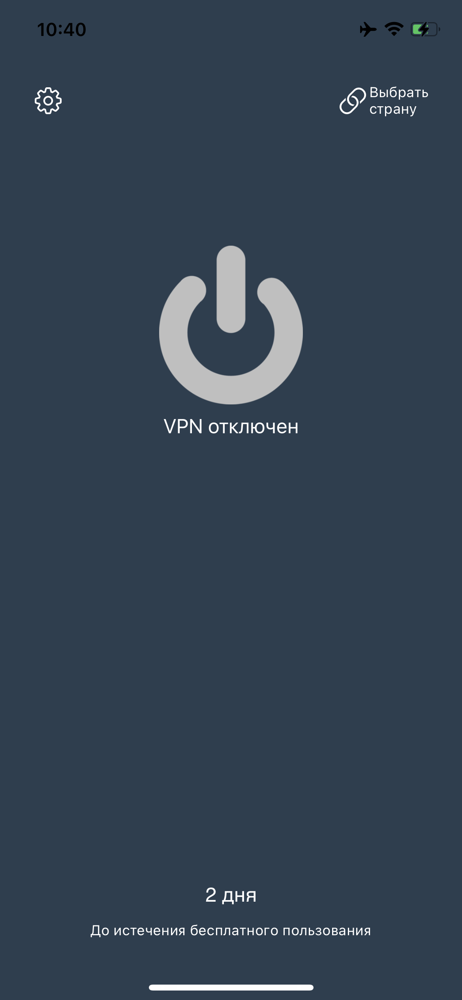
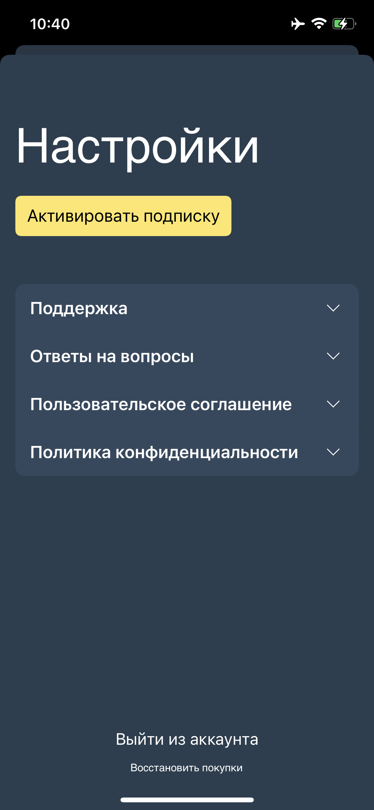

VPN Manager

Функции 

1) Регистрация пользователя
2) Аунтефикация по номеру
3) Пробный период в 7 дней
4) Премиум аккаунт на 1 месяц с возможностью доступа к ВПН
5) Подключение впн по протоколу IKEv2
6) Выбор страны подключения
7) Отслеживание статуса ВПН

